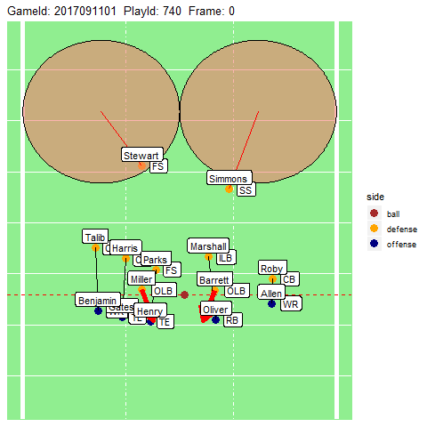

# Big Data Bowl Revisited

The intention of this code is to revisit the data provided by the Big
Data Bowl and to try to do something that was not requested as part of
the three areas originally proposed. 

The goal is to be able to set up a better statistical summary of how routes and coverages interact with each other. I hope to be able to get a better understanding of what routes work well against certain coverages and what players do well against certain coverages with what routes. 

## Visualization of coverage

In the example below a prediction about coverage has been made at the team level and at the individual level. The indiviudal level can be broken up into blitz, man or zone coverage. Blitz coverage is indicated by a red arrow into the backfield. Man coverage is indicated by a line between the defender and the offensive player they are covering. And zone with the area they are predicted to covering. This coverage area is based on the different zone schemes: Cover 1, Cover 2, etc. After individual coverage has been predicted then the team coverage scheme is predicted. In the example below there are 2 deep safeties so Cover 2 is predicted and then the prediction is used to map out where safeties and linebackers not in man coverage might go in a typical defense.

The next step is to use this labeling to determine how successful offensive players can be running certain routes against certain types of defense.